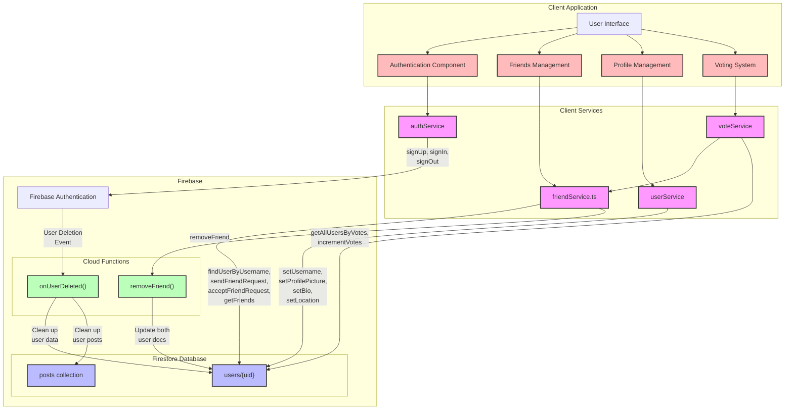
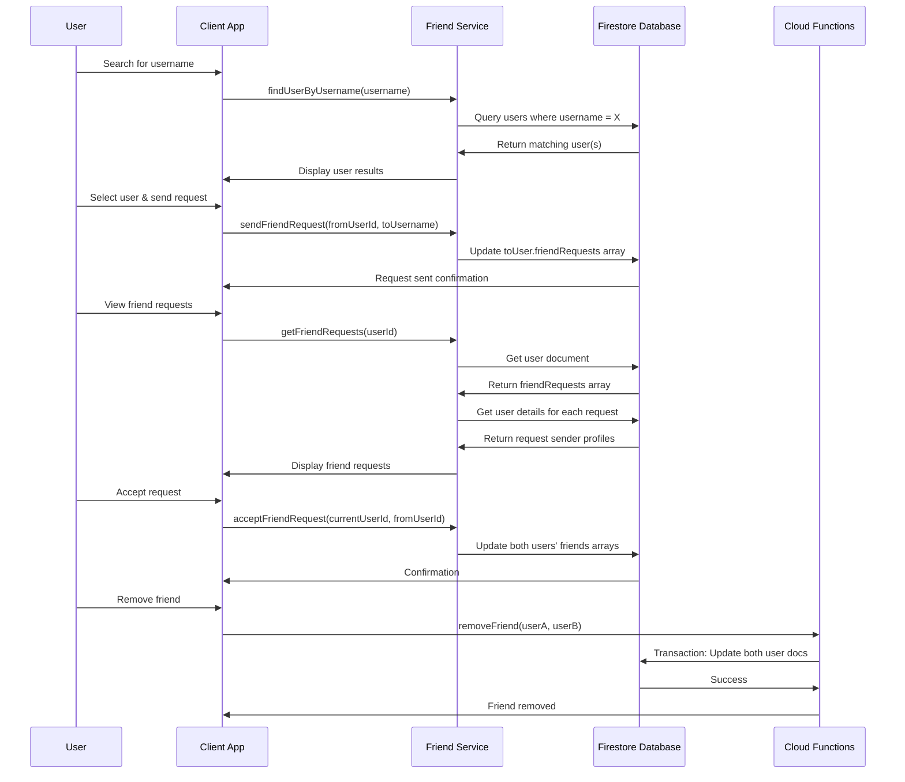
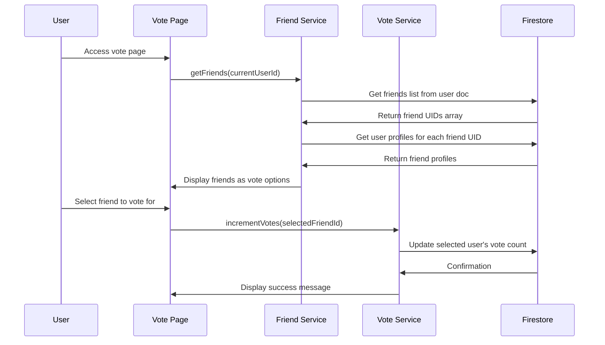
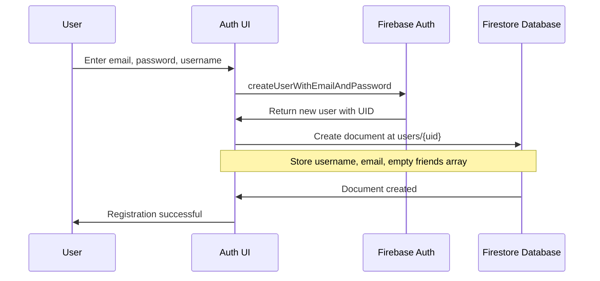
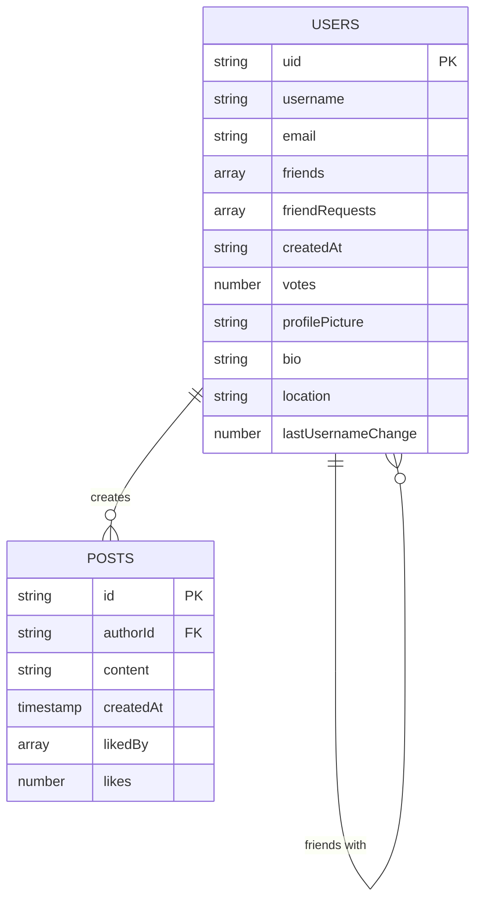
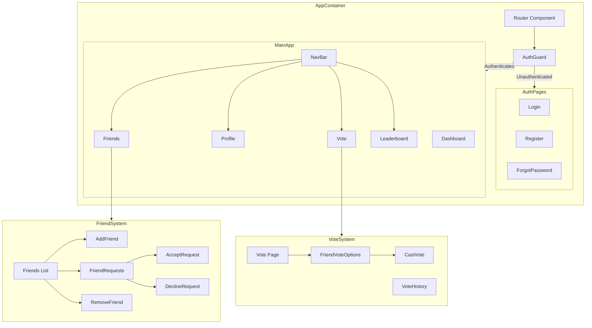

# WitWars System Architecture

## System Flow Diagram

```mermaid
graph TB
    %% Client Components
    subgraph "Client Application"
        UI["User Interface"] 
        Auth["Authentication Component"]
        Friends["Friends Management"]
        Profile["Profile Management"]
        Vote["Voting System"]
    end
    
    %% Client Services
    subgraph "Client Services"
        FriendService["friendService.ts"]
        AuthService["authService"]
        UserService["userService"]
        VoteService["voteService"]
    end
    
    %% Firebase Services
    subgraph "Firebase"
        FireAuth["Firebase Authentication"]
        
        subgraph "Cloud Functions"
            OnUserDeleted["onUserDeleted()"]
            RemoveFriend["removeFriend()"]
        end
        
        subgraph "Firestore Database"
            Users["users/{uid}"]
            Posts["posts collection"]
        end
    end
    
    %% Connections - UI to Services
    UI --> Auth
    UI --> Friends
    UI --> Profile
    UI --> Vote
    
    %% Service Logic
    Auth --> AuthService
    Friends --> FriendService
    Profile --> UserService
    Vote --> VoteService --> FriendService
    
    %% Services to Firebase
    AuthService -- "signUp, signIn,\nsignOut" --> FireAuth
    
    FriendService -- "findUserByUsername,\nsendFriendRequest,\nacceptFriendRequest,\ngetFriends" --> Users
    
    UserService -- "setUsername,\nsetProfilePicture,\nsetBio,\nsetLocation" --> Users
    
    VoteService -- "getAllUsersByVotes,\nincrementVotes" --> Users
    
    FriendService -- "removeFriend" --> RemoveFriend
    
    %% Firebase Connections
    FireAuth -- "User Deletion\nEvent" --> OnUserDeleted
    OnUserDeleted -- "Clean up\nuser data" --> Users
    OnUserDeleted -- "Clean up\nuser posts" --> Posts
    
    RemoveFriend -- "Update both\nuser docs" --> Users

    %% Add notes for clarity
    classDef service fill:#f9f,stroke:#333,stroke-width:2px
    classDef database fill:#bbf,stroke:#333,stroke-width:2px
    classDef function fill:#bfb,stroke:#333,stroke-width:2px
    classDef component fill:#fbb,stroke:#333,stroke-width:2px
    
    class FriendService,AuthService,UserService,VoteService service
    class Users,Posts database
    class OnUserDeleted,RemoveFriend function
    class Auth,Friends,Profile,Vote component
```

## Friend System Data Flow

```mermaid
sequenceDiagram
    participant User as User
    participant Client as Client App
    participant FS as Friend Service
    participant FB as Firestore Database
    participant CF as Cloud Functions
    
    %% Add Friend Flow
    User->>Client: Search for username
    Client->>FS: findUserByUsername(username)
    FS->>FB: Query users where username = X
    FB->>FS: Return matching user(s)
    FS->>Client: Display user results
    User->>Client: Select user & send request
    Client->>FS: sendFriendRequest(fromUserId, toUsername)
    FS->>FB: Update toUser.friendRequests array
    FB->>Client: Request sent confirmation
    
    %% Accept Friend Flow
    User->>Client: View friend requests
    Client->>FS: getFriendRequests(userId)
    FS->>FB: Get user document
    FB->>FS: Return friendRequests array
    FS->>FB: Get user details for each request
    FB->>FS: Return request sender profiles
    FS->>Client: Display friend requests
    User->>Client: Accept request
    Client->>FS: acceptFriendRequest(currentUserId, fromUserId)
    FS->>FB: Update both users' friends arrays
    FB->>Client: Confirmation
    
    %% Remove Friend Flow (Cloud Function)
    User->>Client: Remove friend
    Client->>CF: removeFriend(userA, userB)
    CF->>FB: Transaction: Update both user docs
    FB->>CF: Success
    CF->>Client: Friend removed
```

## Voting System

```mermaid
sequenceDiagram
    participant User as User
    participant Vote as Vote Page
    participant FriendSvc as Friend Service
    participant VoteSvc as Vote Service
    participant FB as Firestore
    
    %% Load Vote Page
    User->>Vote: Access vote page
    Vote->>FriendSvc: getFriends(currentUserId)
    FriendSvc->>FB: Get friends list from user doc
    FB->>FriendSvc: Return friend UIDs array
    FriendSvc->>FB: Get user profiles for each friend UID
    FB->>FriendSvc: Return friend profiles
    FriendSvc->>Vote: Display friends as vote options
    
    %% Cast Vote
    User->>Vote: Select friend to vote for
    Vote->>VoteSvc: incrementVotes(selectedFriendId)
    VoteSvc->>FB: Update selected user's vote count
    FB->>VoteSvc: Confirmation
    VoteSvc->>Vote: Display success message
```

## User Registration Flow

```mermaid
sequenceDiagram
    participant User as User
    participant Auth as Auth UI
    participant Firebase as Firebase Auth
    participant Firestore as Firestore Database
    
    User->>Auth: Enter email, password, username
    Auth->>Firebase: createUserWithEmailAndPassword
    Firebase->>Auth: Return new user with UID
    Auth->>Firestore: Create document at users/{uid}
    Note over Auth,Firestore: Store username, email, empty friends array
    Firestore->>Auth: Document created
    Auth->>User: Registration successful
```

## Database Schema

```mermaid
erDiagram
    USERS {
        string uid PK
        string username
        string email
        array friends
        array friendRequests
        string createdAt
        number votes
        string profilePicture
        string bio
        string location
        number lastUsernameChange
    }
    
    POSTS {
        string id PK
        string authorId FK
        string content
        timestamp createdAt
        array likedBy
        number likes
    }
    
    USERS ||--o{ POSTS : "creates"
    USERS ||--o{ USERS : "friends with"
```

## WitWars Component Architecture

```mermaid
flowchart TD
    subgraph AppContainer
        Router["Router Component"] --> AuthGuard
        AuthGuard -- "Authenticated" --> MainApp
        AuthGuard -- "Unauthenticated" --> AuthPages
    end
    
    subgraph AuthPages
        Login
        Register
        ForgotPassword
    end
    
    subgraph MainApp
        Dashboard
        NavBar --> Friends
        NavBar --> Profile
        NavBar --> Vote
        NavBar --> Leaderboard
    end
    
    subgraph FriendSystem
        FriendsList["Friends List"] --> AddFriend
        FriendsList --> FriendRequests
        FriendRequests --> AcceptRequest
        FriendRequests --> DeclineRequest
        FriendsList --> RemoveFriend
    end
    
    Friends --> FriendSystem
    
    subgraph VoteSystem
        VotePage["Vote Page"] --> FriendVoteOptions
        FriendVoteOptions --> CastVote
        VoteHistory
    end
    
    Vote --> VoteSystem
```
